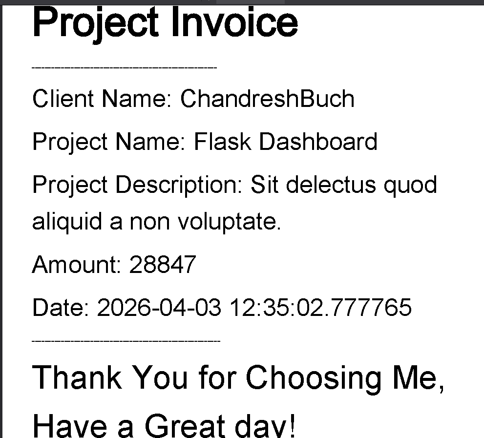

# FreelanceAndPaymentTracker


[](https://opensource.org/licenses/MIT)
[](http://makeapullrequest.com)


**FreelanceFlow** is a powerful, self-hosted web application designed for freelancers to effortlessly track their active projects, manage client details, and monitor payments. Say goodbye to messy spreadsheets and generate invoices with just a click.


[🔗 Live Demo Link] | [📂 Bug Report] | [💡 Feature Request]


#### Link for Freelance and Payment Tracker - https://freelancetracker.onrender.com/


---


## 🚀 Key Features

- **Project Management:** Track ongoing gigs, deadlines, and project statuses (Not Started, Pending, Completed).
- **Payment & Milestone:** Monitor pending, completed, and overdue payments with automated color coding, add milestone for payments.
- **Client CRM:** Keep all client contact information and project history in one centralized hub.
- **Dockerized Setup:** Spin up the entire environment locally with a single command with docker-compose file.
- **Spring Boot Microservice:** To keep the extremely effecient and scalable in production environment, used for invoice pdf generation. 

---

## 🛠️ Tech Stack


**Frontend:**
- [Bootstrap / css / HTML5] - Basic Component-based UI.


**Backend:**
- [Spring Boot / Python Django ] - Robust REST API handling business logic with Java Spring Boot Microservice for invoice generation.
- [Django authentication] - For secure user authentication.


**Database & DevOps:**
- [PostgreSQL ] - Relational data storage for clients,payments,project details, milesotne.
- [MongoDB ] - NoSQL data base storage to store Unstructured communication logs of client and freelancer.
- [Docker ]- Containerization for seamless deployment.
- [Render ]- for deployment.


---


## 📸 Screenshots


| Dashboard Overview | Client Side Dashboard |
| :---: | :---: |
|  |  |
| **Client List** | **Client Project List** |
|  |  |
| **Project Details** | **Generated Invoice (Spring Boot)** |
|  |  |


---


## ⚙️ Installation & Setup


Follow these steps to get the project running locally on your machine.


### Prerequisites

- Docker & Docker Compose (recommended)

### Other way of installation

- Python 3.9 +
- JDK 24 + 
- Postgresql 18 + version
- MongoDB
- Maven build tool
- Spring Boot

### Installation using docker-compose

- Make a .env file and store all the required Parameters and Variables in side that file (Important).
- Using Docker Compose inside the FreelanceAndPaymentTracker where docker-compose.yml file is present [ docker-compose build freelancetrackerapp:V1 ].

### Installation using Python for django and Maven for Java Spring Boot


- Using Python and JDK  make use machine has both of thier required version installed along with any IDE or Visual Studio Code(VS code)
- First recommended to make a virtual environment using command [ python -m venv env ]
- Activate the virtual environment using command [./env/Scripts/Activate ]
- Install all prerequisites python libraries using requirement.txt [ pip install -r requirements.txt ]
- Make a .env file for secret Variables to match requirement parameters and variables in the program.(Important)
- Make sure all the database related credentials are present in the .env file .
- Run the following Command [python manage.py runserver]

## 🌐 API Documentation


* **Spring Boot Invoice Service API Docs:** `http://localhost:8080/api/docs`


* **Django Core API Docs:** `http://localhost:8000/api/docs/`


## 🏗️ System Architecture 


### 1. Clone the Repository


```bash
git clone [https://github.com/zicots7/FreelanceAndPaymentTracker.git](https://github.com/zicots7/FreelanceAndPaymentTracker.git)
cd freelance-payment-tracker
